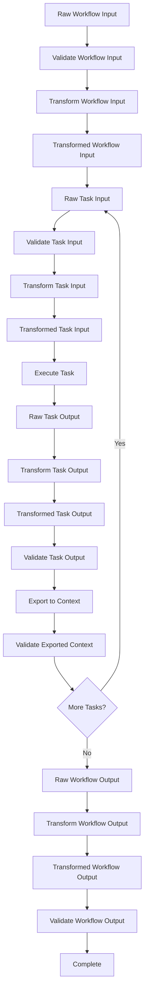

## Overview

In Serverless Workflow DSL, data flow management is crucial to ensure that the right data is passed between tasks and to the workflow itself. The DSL provides comprehensive mechanisms for validating, transforming, and managing data as it flows through the workflow execution.

<Info>
  Data flows through multiple transformation stages, each with specific purposes for validation, filtering, and context management.
</Info>

## Data Flow Pipeline

Data flows through a workflow in a structured pipeline with multiple stages:



## Workflow Input Processing

### Validation

Before the workflow starts, input data can be validated against a JSON Schema:

```yaml
input:
  schema:
    document:
      type: object
      properties:
        userId:
          type: string
          pattern: "^[a-zA-Z0-9]{8,}$"
        email:
          type: string
          format: email
        age:
          type: integer
          minimum: 18
          maximum: 120
      required:
        - userId
        - email
```

<ParamField path="input.schema" type="object">
  JSON Schema to validate the workflow input against before execution begins
</ParamField>

<Warning>
  If validation fails, the workflow execution faults with a ValidationError (`https://serverlessworkflow.io/spec/1.0.0/errors/validation`).
</Warning>

### Transformation

The input data can be transformed to ensure only relevant data in the expected format is passed into the workflow context:

```yaml
input:
  from: ${ { id: .userId, contact: .email, metadata: { timestamp: now, version: "1.0" } } }
```

<ParamField path="input.from" type="string">
  Runtime expression that evaluates on the raw workflow input. Defaults to identity expression `${ . }` which leaves input unchanged.
</ParamField>

<Note>
  The result of the `input.from` expression sets the initial value for the `$input` runtime expression argument and is passed to the first task.
</Note>

### Complete Workflow Input Example

```yaml
document:
  dsl: '1.0.3'
  namespace: users
  name: user-registration
  version: '1.0.0'

input:
  schema:
    document:
      type: object
      properties:
        username:
          type: string
          minLength: 3
          maxLength: 20
        email:
          type: string
          format: email
        profile:
          type: object
          properties:
            firstName:
              type: string
            lastName:
              type: string
            dateOfBirth:
              type: string
              format: date
      required:
        - username
        - email
        - profile
  from: ${ { 
    username: .username, 
    email: .email, 
    fullName: "\(.profile.firstName) \(.profile.lastName)",
    registeredAt: now 
  } }

do:
  - createUser:
      call: userService
      with:
        data: ${ $input }
```

## Task Input Processing

### Raw Task Input

Each task receives raw input, which is:
- For the first task: the transformed workflow input
- For subsequent tasks: the transformed output of the previous task

### Input Validation

Before a task executes, its raw input can be validated:

```yaml
processOrder:
  input:
    schema:
      document:
        type: object
        properties:
          orderId:
            type: string
          items:
            type: array
            minItems: 1
            items:
              type: object
              properties:
                productId:
                  type: string
                quantity:
                  type: integer
                  minimum: 1
        required:
          - orderId
          - items
  call: orderProcessor
  with:
    order: ${ . }
```

<ParamField path="input.schema" type="object">
  JSON Schema to validate task input before execution
</ParamField>

### Input Transformation

The input data for a task can be transformed to match specific requirements:

```yaml
processData:
  input:
    from: ${ { 
      id: .userId, 
      data: .payload.data, 
      options: { 
        validate: true, 
        normalize: true 
      } 
    } }
  call: dataProcessor
  with:
    input: ${ $input }
```

<ParamField path="input.from" type="string">
  Runtime expression that evaluates the raw task input. Defaults to identity expression `${ . }`.
</ParamField>

<Info>
  The result of `input.from` is set as the `$input` runtime expression argument and is used to evaluate any runtime expressions within the task definition.
</Info>

### Example: Filtering and Reshaping Input

```yaml
do:
  - fetchUserData:
      call: http
      with:
        method: get
        endpoint:
          uri: https://api.example.com/users/${ .userId }
  
  - processUserData:
      input:
        from: ${ {
          userId: .fetchUserData.output.id,
          profile: {
            name: .fetchUserData.output.firstName + " " + .fetchUserData.output.lastName,
            email: .fetchUserData.output.email,
            verified: .fetchUserData.output.emailVerified
          },
          preferences: .fetchUserData.output.settings // { marketing: true }
        } }
      call: userProcessor
      with:
        user: ${ $input }
```

## Task Output Processing

### Output Transformation

After completing a task, its output can be transformed before passing it to the next task:

```yaml
fetchData:
  call: http
  with:
    method: get
    endpoint:
      uri: https://api.example.com/data
  output:
    as: ${ { 
      items: .body.results, 
      count: .body.total, 
      processedAt: now 
    } }
```

<ParamField path="output.as" type="string">
  Runtime expression that evaluates the raw task output. Defaults to identity expression `${ . }`.
</ParamField>

<Note>
  The result of `output.as` becomes the input for the next task and is set as the `$output` runtime expression argument.
</Note>

### Output Validation

After transformation, the task output can be validated:

```yaml
processData:
  call: processor
  with:
    data: ${ .inputData }
  output:
    as: ${ . }
    schema:
      document:
        type: object
        properties:
          result:
            type: string
            enum: [success, failure]
          data:
            type: object
          timestamp:
            type: string
            format: date-time
        required:
          - result
          - timestamp
```

<ParamField path="output.schema" type="object">
  JSON Schema to validate the transformed task output
</ParamField>

### Example: Extracting Relevant Data

```yaml
do:
  - fetchProducts:
      call: http
      with:
        method: get
        endpoint:
          uri: https://api.example.com/products
      output:
        as: ${ 
          .body.products | map({
            id: .id,
            name: .name,
            price: .price,
            available: .inventory > 0
          })
        }
```

## Context Management

The workflow context (`$context`) is a persistent data store that maintains state across task executions.

### Initial Context

The initial context is set to the transformed workflow input:

```yaml
input:
  from: ${ { userId: .id, timestamp: now } }

do:
  - firstTask:
      call: someFunction
      with:
        context: ${ $context }  # Contains { userId: "...", timestamp: "..." }
```

### Exporting to Context

Tasks can update the workflow context using the `export.as` expression:

```yaml
fetchUser:
  call: http
  with:
    method: get
    endpoint:
      uri: https://api.example.com/users/${ .userId }
  export:
    as: ${ $context + { user: $output } }
```

<ParamField path="export.as" type="string">
  Runtime expression that evaluates the transformed task output and produces the new context. Defaults to returning the existing context unchanged.
</ParamField>

<Info>
  The result of `export.as` replaces the workflow's current context and updates the `$context` runtime expression argument.
</Info>

### Context Validation

The exported context can be validated:

```yaml
addUserData:
  call: processor
  with:
    data: ${ .data }
  export:
    as: ${ $context + { userData: $output } }
    schema:
      document:
        type: object
        properties:
          userId:
            type: string
          userData:
            type: object
        required:
          - userId
          - userData
```

<ParamField path="export.schema" type="object">
  JSON Schema to validate the exported context
</ParamField>

### Example: Building Context Incrementally

```yaml
do:
  - fetchUser:
      call: http
      with:
        method: get
        endpoint:
          uri: https://api.example.com/users/${ .userId }
      export:
        as: ${ $context + { user: $output.body } }
  
  - fetchOrders:
      call: http
      with:
        method: get
        endpoint:
          uri: https://api.example.com/orders?userId=${ $context.user.id }
      export:
        as: ${ $context + { orders: $output.body } }
  
  - fetchPreferences:
      call: http
      with:
        method: get
        endpoint:
          uri: https://api.example.com/preferences/${ $context.user.id }
      export:
        as: ${ $context + { preferences: $output.body } }
  
  - generateReport:
      call: reportGenerator
      with:
        user: ${ $context.user }
        orders: ${ $context.orders }
        preferences: ${ $context.preferences }
```

## Workflow Output Processing

### Output Transformation

The final workflow output can be transformed:

```yaml
do:
  - processData:
      call: processor
  
  - finalizeResults:
      call: finalizer

output:
  as: ${ { 
    status: "completed", 
    result: .finalizeResults.output.result, 
    processedAt: now,
    summary: {
      itemsProcessed: .processData.output.count,
      duration: "5 minutes"
    }
  } }
```

<ParamField path="output.as" type="string">
  Runtime expression that evaluates the last task's transformed output. Defaults to identity expression.
</ParamField>

### Output Validation

The transformed workflow output can be validated:

```yaml
output:
  as: ${ . }
  schema:
    document:
      type: object
      properties:
        status:
          type: string
          enum: [success, failure]
        result:
          type: object
        timestamp:
          type: string
          format: date-time
      required:
        - status
        - result
        - timestamp
```

<ParamField path="output.schema" type="object">
  JSON Schema to validate the transformed workflow output
</ParamField>

## Runtime Expression Arguments

Different runtime expression arguments are available at different stages:

| Expression Location | `$context` | `$input` | `$output` | `$secrets` | `$task` | `$workflow` | `$runtime` |
|:-------------------|:----------:|:--------:|:---------:|:----------:|:-------:|:-----------:|:----------:|
| Workflow `input.from` | | | | ✔ | | ✔ | ✔ |
| Task `if` | ✔ | | | ✔ | ✔ | ✔ | ✔ |
| Task `input.from` | ✔ | | | ✔ | ✔ | ✔ | ✔ |
| Task definition | ✔ | ✔ | | ✔ | ✔ | ✔ | ✔ |
| Task `output.as` | ✔ | ✔ | | ✔ | ✔ | ✔ | ✔ |
| Task `export.as` | ✔ | ✔ | ✔ | ✔ | ✔ | ✔ | ✔ |
| Workflow `output.as` | ✔ | | | ✔ | | ✔ | ✔ |

<Warning>
  Use `$secrets` with caution: incorporating them in expressions or passing them as call inputs may inadvertently expose sensitive information. Secrets can only be used in the `input.from` runtime expression to avoid unintentional bleeding.
</Warning>

## Data Flow Patterns

### Pattern: Data Enrichment Pipeline

```yaml
do:
  - fetchBaseData:
      call: http
      with:
        method: get
        endpoint:
          uri: https://api.example.com/base/${ .id }
      output:
        as: ${ .body }
      export:
        as: ${ { base: $output } }
  
  - enrichWithDetails:
      call: http
      with:
        method: get
        endpoint:
          uri: https://api.example.com/details/${ $context.base.id }
      output:
        as: ${ .body }
      export:
        as: ${ $context + { details: $output } }
  
  - enrichWithMetadata:
      call: http
      with:
        method: get
        endpoint:
          uri: https://api.example.com/metadata/${ $context.base.id }
      output:
        as: ${ .body }
      export:
        as: ${ $context + { metadata: $output } }
  
  - combineData:
      set:
        enrichedData: ${ {
          id: $context.base.id,
          name: $context.base.name,
          details: $context.details,
          metadata: $context.metadata,
          enrichedAt: now
        } }
```

### Pattern: Data Filtering and Projection

```yaml
do:
  - fetchAllUsers:
      call: http
      with:
        method: get
        endpoint:
          uri: https://api.example.com/users
      output:
        as: ${ 
          .body.users | 
          map(select(.active == true)) | 
          map({ id: .id, name: .name, email: .email })
        }
```

### Pattern: Conditional Data Transformation

```yaml
do:
  - processWithCondition:
      call: dataSource
      output:
        as: ${ 
          if .status == "premium" then
            { data: .fullData, tier: "premium" }
          else
            { data: .basicData, tier: "basic" }
          end
        }
```

### Pattern: Data Aggregation

```yaml
do:
  - fetchMultipleSources:
      fork:
        branches:
          - source1:
              call: http
              with:
                method: get
                endpoint:
                  uri: https://api1.example.com/data
          - source2:
              call: http
              with:
                method: get
                endpoint:
                  uri: https://api2.example.com/data
          - source3:
              call: http
              with:
                method: get
                endpoint:
                  uri: https://api3.example.com/data
  
  - aggregateResults:
      set:
        combined: ${ {
          source1Data: .fetchMultipleSources.source1.output.body,
          source2Data: .fetchMultipleSources.source2.output.body,
          source3Data: .fetchMultipleSources.source3.output.body,
          aggregatedAt: now
        } }
```

### Pattern: Data Validation Pipeline

```yaml
do:
  - validateStructure:
      input:
        schema:
          document:
            type: object
            properties:
              data:
                type: object
            required:
              - data
      call: structureValidator
      with:
        input: ${ . }
  
  - validateBusinessRules:
      call: businessRuleValidator
      with:
        data: ${ .validateStructure.output }
  
  - validateIntegrity:
      call: integrityValidator
      with:
        data: ${ .validateBusinessRules.output }
      output:
        schema:
          document:
            type: object
            properties:
              valid:
                type: boolean
              data:
                type: object
            required:
              - valid
              - data
```

## Best Practices

<Steps>
  <Step title="Always validate inputs">
    Use JSON Schema validation for workflow and task inputs to catch errors early and ensure data integrity.
  </Step>
  
  <Step title="Transform data as close to the source as possible">
    Apply input transformations immediately after receiving data to work with clean, relevant data structures.
  </Step>
  
  <Step title="Keep context minimal">
    Only export data to context that needs to be shared across multiple tasks. Avoid cluttering context with unnecessary data.
  </Step>
  
  <Step title="Use explicit transformations">
    Make data transformations explicit and readable. Avoid complex nested expressions that are hard to understand.
  </Step>
  
  <Step title="Validate at boundaries">
    Validate data at workflow boundaries (input/output) and at critical transformation points.
  </Step>
  
  <Step title="Document data structures">
    Use descriptive property names and include schema documentation for complex data structures.
  </Step>
</Steps>

## Common Pitfalls

### Avoiding Context Pollution

```yaml
# Bad: Exporting everything to context
export:
  as: ${ $context + $output }

# Good: Exporting only what's needed
export:
  as: ${ $context + { userId: $output.id, status: $output.status } }
```

### Handling Null Values

```yaml
# Bad: Assuming data exists
output:
  as: ${ .user.profile.email }

# Good: Handling potential null values
output:
  as: ${ .user.profile.email // "no-email@example.com" }
```

### Proper Data Transformation

```yaml
# Bad: Complex inline transformation
output:
  as: ${ { a: .data.items[0].values[2].nested.prop, b: (.data.summary.total / .data.summary.count) * 100 } }

# Good: Step-by-step transformation
do:
  - extractValue:
      set:
        extractedProp: ${ .data.items[0].values[2].nested.prop }
  
  - calculatePercentage:
      set:
        percentage: ${ (.data.summary.total / .data.summary.count) * 100 }
  
  - combineResults:
      set:
        result: ${ { a: .extractedProp, b: .percentage } }
```

## Related Topics

- [Workflows](/core/workflows) - Learn about workflow structure and components
- [Tasks](/core/tasks) - Understand different task types
- [Runtime Expressions](/core/runtime-expressions) - Deep dive into expression syntax
- [Task Flow](/core/task-flow) - Understand task execution order
