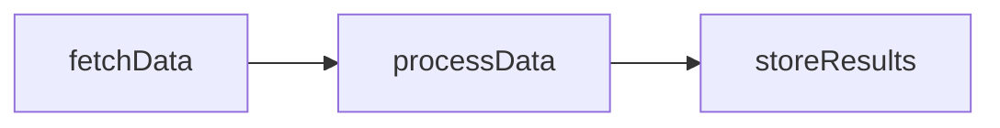
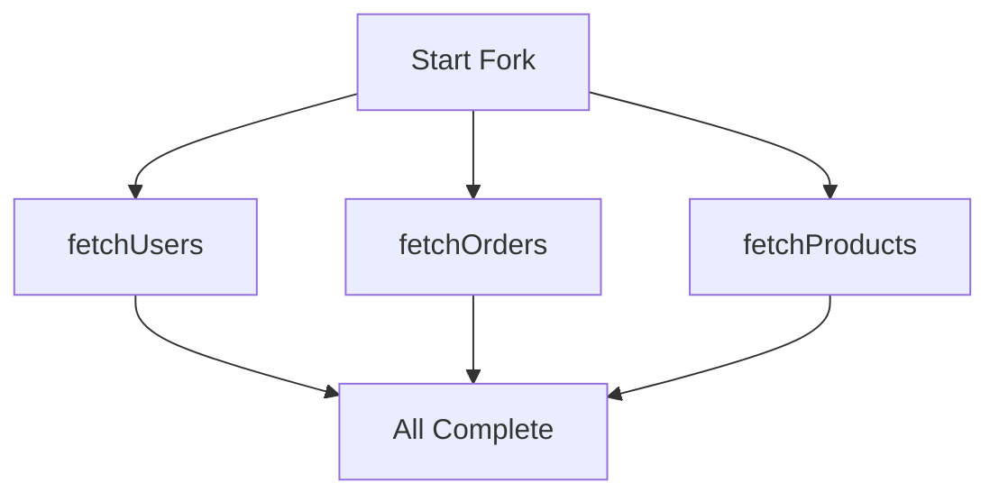

## Overview

Task flow determines the order and manner in which tasks are executed within a workflow. By default, tasks execute sequentially in the order they are declared. However, Serverless Workflow provides powerful mechanisms to control execution flow, including parallel execution, conditional branching, and explicit flow directives.

## Sequential Execution

By default, tasks in a workflow execute sequentially, one after another:

```yaml
do:
  - fetchData:
      call: http
      with:
        method: get
        endpoint:
          uri: https://api.example.com/data
  
  - processData:
      call: processFunction
      with:
        input: ${ .fetchData.output }
  
  - storeResults:
      call: http
      with:
        method: post
        endpoint:
          uri: https://api.example.com/results
        body: ${ .processData.output }
```

<Info>
  In sequential execution, each task waits for the previous task to complete before starting. The output of one task becomes available as input to the next.
</Info>

### Sequential Execution Flow



## Parallel Execution

The `fork` task enables parallel execution of multiple tasks simultaneously:

```yaml
do:
  - fetchAllData:
      fork:
        branches:
          - fetchUsers:
              call: http
              with:
                method: get
                endpoint:
                  uri: https://api.example.com/users
          
          - fetchOrders:
              call: http
              with:
                method: get
                endpoint:
                  uri: https://api.example.com/orders
          
          - fetchProducts:
              call: http
              with:
                method: get
                endpoint:
                  uri: https://api.example.com/products
```

<ParamField path="fork.branches" type="array" required>
  List of task branches to execute concurrently
</ParamField>

<ParamField path="fork.compete" type="boolean">
  If true, the first branch to complete successfully wins and other branches are cancelled
</ParamField>

### Parallel Execution Flow



### Competition Mode

When `compete` is set to true, branches race against each other:

```yaml
do:
  - fetchFromMultipleSources:
      fork:
        compete: true
        branches:
          - fetchFromPrimary:
              call: http
              with:
                method: get
                endpoint:
                  uri: https://primary.example.com/api/data
          
          - fetchFromSecondary:
              call: http
              with:
                method: get
                endpoint:
                  uri: https://secondary.example.com/api/data
          
          - fetchFromTertiary:
              call: http
              with:
                method: get
                endpoint:
                  uri: https://tertiary.example.com/api/data
```

<Note>
  In competition mode, the workflow continues with the output of the first branch to complete successfully, and remaining branches are automatically cancelled.
</Note>

## Task Flow After Execution

Once a task has been executed, different outcomes determine what happens next:

### Continue

The task ran to completion, and the next task should be executed:

```yaml
do:
  - task1:
      call: function1
  - task2:          # Executes after task1 completes
      call: function2
  - task3:          # Executes after task2 completes
      call: function3
```

The next task is implicitly the next in declaration order, or explicitly defined by the `then` property.

### Fault

The task raised an uncaught error, which abruptly halts the workflow's execution:

```yaml
do:
  - riskyOperation:
      call: http
      with:
        method: get
        endpoint:
          uri: https://api.example.com/data
  # If riskyOperation fails without error handling,
  # the workflow transitions to 'faulted' status
```

<Warning>
  When a task faults without error handling, the workflow immediately transitions to the `faulted` status phase and no subsequent tasks execute.
</Warning>

### End

The task explicitly and gracefully ends the workflow's execution:

```yaml
do:
  - checkCondition:
      call: validateInput
  
  - earlyExit:
      if: ${ .checkCondition.output.isValid == false }
      then: end
  
  - continueProcessing:
      call: processData
  # This task only executes if earlyExit didn't trigger
```

If the executed task is the last task, the workflow's execution gracefully ends.

## Flow Directives

Flow directives provide explicit control over task execution order using the `then` property:

### Basic Flow Control

```yaml
do:
  - task1:
      call: function1
      then: task3        # Skip task2, go directly to task3
  
  - task2:
      call: function2    # This task is skipped
  
  - task3:
      call: function3
```

<ParamField path="then" type="string">
  Specifies the name of the next task to execute, or `end` to gracefully terminate the workflow
</ParamField>

### Ending Workflow Early

```yaml
do:
  - validateInput:
      call: validator
  
  - checkValidation:
      if: ${ .validateInput.output.isValid == false }
      call: logError
      then: end          # End workflow gracefully
  
  - processData:
      call: processor
  
  - storeResults:
      call: storage
```

### Conditional Branching with Flow Directives

```yaml
do:
  - checkStatus:
      call: getStatus
  
  - routeBasedOnStatus:
      switch:
        - when: ${ .checkStatus.output.status == "urgent" }
          then: handleUrgent
        - when: ${ .checkStatus.output.status == "normal" }
          then: handleNormal
        - when: ${ .checkStatus.output.status == "low" }
          then: handleLow
  
  - handleUrgent:
      call: urgentProcessor
      then: finalizeProcess
  
  - handleNormal:
      call: normalProcessor
      then: finalizeProcess
  
  - handleLow:
      call: lowPriorityProcessor
      then: finalizeProcess
  
  - finalizeProcess:
      call: finalize
```

<Warning>
  Flow directives may only redirect to tasks declared within their own scope. In other words, they cannot target tasks at a different depth in the task hierarchy.
</Warning>

### Scope Restrictions

```yaml
do:
  - parentTask:
      do:
        - childTask1:
            call: function1
            then: childTask2    # Valid: same scope
        
        - childTask2:
            call: function2
            # then: siblingTask  # INVALID: cannot jump to parent scope
  
  - siblingTask:
      call: function3
      # then: childTask1      # INVALID: cannot jump into nested scope
```

## Conditional Execution

The `if` property enables conditional task execution:

```yaml
do:
  - checkUserRole:
      call: getUserRole
      with:
        userId: ${ .userId }
  
  - processAdmin:
      if: ${ .checkUserRole.output.role == "admin" }
      call: adminProcessor
      with:
        data: ${ .data }
  
  - processRegularUser:
      if: ${ .checkUserRole.output.role == "user" }
      call: userProcessor
      with:
        data: ${ .data }
```

<ParamField path="if" type="string">
  Runtime expression that evaluates to a boolean. If false, the task is skipped entirely.
</ParamField>

<Info>
  When a task is skipped due to a false `if` condition, the workflow continues to the next task without error.
</Info>

## Switch Task for Complex Branching

The `switch` task provides a structured way to implement complex conditional logic:

```yaml
do:
  - routeRequest:
      switch:
        - when: ${ .request.type == "query" }
          then: handleQuery
        - when: ${ .request.type == "mutation" }
          then: handleMutation
        - when: ${ .request.type == "subscription" }
          then: handleSubscription
  
  - handleQuery:
      call: queryProcessor
      then: finalizeRequest
  
  - handleMutation:
      call: mutationProcessor
      then: finalizeRequest
  
  - handleSubscription:
      call: subscriptionProcessor
      then: finalizeRequest
  
  - finalizeRequest:
      call: sendResponse
```

<ParamField path="switch" type="array" required>
  Array of conditional branches, each with a `when` condition and optional `then` target
</ParamField>

### Switch with Default Case

```yaml
do:
  - processRequest:
      switch:
        - when: ${ .priority == "high" }
          then: processHighPriority
        - when: ${ .priority == "medium" }
          then: processMediumPriority
        - when: ${ .priority == "low" }
          then: processLowPriority
        - when: true                    # Default case
          then: processUnknownPriority
```

## Iteration with For Task

The `for` task enables iteration over collections:

```yaml
do:
  - processOrders:
      for:
        each: order
        in: ${ .orders }
        at: index
      do:
        - validateOrder:
            call: validator
            with:
              order: ${ .order }
              index: ${ .index }
        
        - processOrder:
            if: ${ .validateOrder.output.isValid }
            call: processor
            with:
              order: ${ .order }
```

<ParamField path="for.each" type="string" required>
  Variable name to hold the current item
</ParamField>

<ParamField path="for.in" type="string" required>
  Runtime expression evaluating to the collection to iterate
</ParamField>

<ParamField path="for.at" type="string">
  Optional variable name to hold the current iteration index (0-based)
</ParamField>

<ParamField path="for.while" type="string">
  Optional condition to continue iteration. Loop breaks when condition becomes false.
</ParamField>

### Sequential Processing of Items

```yaml
do:
  - processUsersBatch:
      for:
        each: user
        in: ${ .users }
      do:
        - fetchUserDetails:
            call: http
            with:
              method: get
              endpoint:
                uri: https://api.example.com/users/${ .user.id }
        
        - updateUserProfile:
            call: http
            with:
              method: put
              endpoint:
                uri: https://api.example.com/users/${ .user.id }
              body: ${ .fetchUserDetails.output }
```

### Conditional Iteration

```yaml
do:
  - processUntilLimit:
      for:
        each: item
        in: ${ .items }
        at: index
        while: ${ .index < 10 }    # Stop after 10 items
      do:
        - processItem:
            call: processor
            with:
              item: ${ .item }
```

## Do Task for Grouping

The `do` task groups multiple tasks into a logical unit:

```yaml
do:
  - initializationPhase:
      do:
        - loadConfig:
            call: loadConfiguration
        
        - validateConfig:
            call: validator
            with:
              config: ${ .loadConfig.output }
        
        - setupResources:
            call: resourceSetup
            with:
              config: ${ .validateConfig.output }
  
  - processingPhase:
      do:
        - fetchData:
            call: dataFetcher
        
        - transformData:
            call: transformer
            with:
              data: ${ .fetchData.output }
        
        - storeData:
            call: storage
            with:
              data: ${ .transformData.output }
```

<Info>
  The `do` task is useful for organizing related tasks and creating logical workflow phases.
</Info>

## Complex Flow Patterns

### Sequential with Parallel Sections

```yaml
do:
  - preparation:
      call: prepareData
  
  - parallelProcessing:
      fork:
        branches:
          - processTypeA:
              call: processorA
              with:
                data: ${ .preparation.output.typeA }
          
          - processTypeB:
              call: processorB
              with:
                data: ${ .preparation.output.typeB }
          
          - processTypeC:
              call: processorC
              with:
                data: ${ .preparation.output.typeC }
  
  - aggregation:
      call: aggregator
      with:
        resultA: ${ .parallelProcessing.processTypeA.output }
        resultB: ${ .parallelProcessing.processTypeB.output }
        resultC: ${ .parallelProcessing.processTypeC.output }
```

### Nested Parallel Execution

```yaml
do:
  - multiLevelParallel:
      fork:
        branches:
          - branch1:
              fork:
                branches:
                  - subbranch1a:
                      call: function1a
                  - subbranch1b:
                      call: function1b
          
          - branch2:
              fork:
                branches:
                  - subbranch2a:
                      call: function2a
                  - subbranch2b:
                      call: function2b
```

### Iteration with Parallel Processing

```yaml
do:
  - processBatches:
      for:
        each: batch
        in: ${ .batches }
      do:
        - processItemsInParallel:
            fork:
              branches:
                - processItem1:
                    call: processor
                    with:
                      item: ${ .batch[0] }
                
                - processItem2:
                    call: processor
                    with:
                      item: ${ .batch[1] }
                
                - processItem3:
                    call: processor
                    with:
                      item: ${ .batch[2] }
```

### Error Recovery with Alternative Flow

```yaml
do:
  - tryPrimaryFlow:
      try:
        do:
          - step1:
              call: primaryFunction1
          - step2:
              call: primaryFunction2
          - step3:
              call: primaryFunction3
      catch:
        errors:
          with:
            type: https://example.com/errors/primary-failure
        then: fallbackFlow
  
  - primarySuccess:
      call: logSuccess
      then: end
  
  - fallbackFlow:
      do:
        - fallbackStep1:
            call: fallbackFunction1
        - fallbackStep2:
            call: fallbackFunction2
```

## Flow Control Best Practices

<Steps>
  <Step title="Use sequential execution by default">
    Only use parallel execution when tasks are truly independent and can benefit from concurrency.
  </Step>
  
  <Step title="Minimize flow directives">
    Let tasks flow naturally in declaration order when possible. Use `then` only when necessary for clarity or optimization.
  </Step>
  
  <Step title="Group related tasks">
    Use `do` tasks to create logical groupings that improve readability and maintainability.
  </Step>
  
  <Step title="Handle errors at appropriate levels">
    Place error handling at the level where you can meaningfully respond to failures.
  </Step>
  
  <Step title="Use switch for multiple conditions">
    When you have multiple mutually exclusive conditions, use `switch` rather than multiple `if` statements.
  </Step>
  
  <Step title="Document complex flows">
    Add comments or use descriptive task names to explain complex flow logic.
  </Step>
</Steps>

## Common Flow Patterns

### Fan-Out/Fan-In Pattern

```yaml
do:
  - fanOut:
      fork:
        branches:
          - worker1:
              call: workerFunction
              with:
                partition: 1
          - worker2:
              call: workerFunction
              with:
                partition: 2
          - worker3:
              call: workerFunction
              with:
                partition: 3
  
  - fanIn:
      call: aggregator
      with:
        results:
          - ${ .fanOut.worker1.output }
          - ${ .fanOut.worker2.output }
          - ${ .fanOut.worker3.output }
```

### Saga Pattern

```yaml
do:
  - reserveInventory:
      try:
        call: inventoryService
        with:
          action: reserve
          items: ${ .orderItems }
      catch:
        then: compensateAll
  
  - processPayment:
      try:
        call: paymentService
        with:
          amount: ${ .orderTotal }
      catch:
        then: compensateInventory
  
  - confirmOrder:
      try:
        call: orderService
        with:
          action: confirm
      catch:
        then: compensatePayment
      then: end
  
  - compensatePayment:
      call: paymentService
      with:
        action: refund
      then: compensateInventory
  
  - compensateInventory:
      call: inventoryService
      with:
        action: release
      then: compensateAll
  
  - compensateAll:
      call: logFailure
```

### Pipeline Pattern

```yaml
do:
  - stage1Extract:
      call: extractData
      with:
        source: ${ .dataSource }
  
  - stage2Transform:
      call: transformData
      with:
        data: ${ .stage1Extract.output }
  
  - stage3Enrich:
      call: enrichData
      with:
        data: ${ .stage2Transform.output }
  
  - stage4Validate:
      call: validateData
      with:
        data: ${ .stage3Enrich.output }
  
  - stage5Load:
      call: loadData
      with:
        data: ${ .stage4Validate.output }
```

### Retry with Exponential Backoff

```yaml
do:
  - attemptOperation:
      try:
        call: unreliableService
        with:
          data: ${ .inputData }
      catch:
        errors:
          with:
            status: 503
        retry:
          delay:
            seconds: 1
          backoff:
            exponential:
              factor: 2
          limit:
            attempt:
              count: 5
```

## Related Topics

- [Workflows](/core/workflows) - Learn about workflow structure and components
- [Tasks](/core/tasks) - Understand different task types and properties
- [Data Flow](/core/data-flow) - Learn how data flows through tasks
- [Runtime Expressions](/core/runtime-expressions) - Use expressions for conditions
- [Fault Tolerance](/core/fault-tolerance) - Handle errors in task execution
