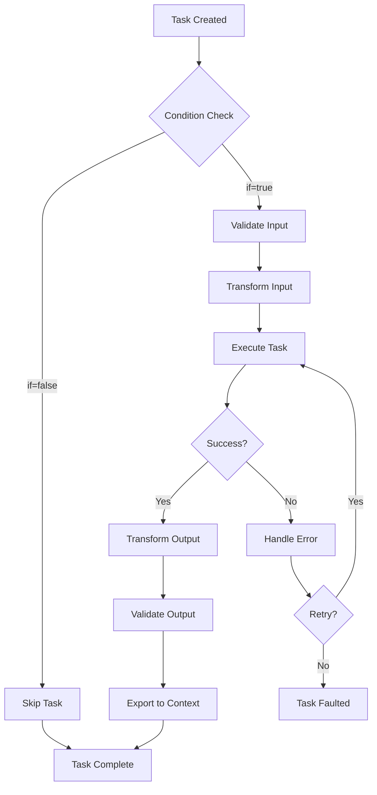

## Overview

Tasks are the fundamental computing units of a workflow. They define the different types of actions that a workflow can perform, including the ability to mutate their input and output data. Tasks can also write to and modify the context data, enabling complex and dynamic workflow behaviors.

<Info>
  All tasks share common properties for input/output transformation, error handling, timeouts, and flow control, making them consistent and predictable across different task types.
</Info>

## Task Types

The Serverless Workflow DSL defines several default task types that runtimes **must** implement:

### Call Task

Used to call services and/or functions:

```yaml
callExample:
  call: http
  with:
    method: get
    endpoint:
      uri: https://api.example.com/data
```

<ParamField path="call" type="string" required>
  The function or service to call (e.g., `http`, `grpc`, `openapi`, `asyncapi`, `a2a`, or a custom function)
</ParamField>

<ParamField path="with" type="object">
  Parameters to pass to the function or service
</ParamField>

### Do Task

Used to define one or more subtasks to perform in sequence:

```yaml
doExample:
  do:
    - step1:
        call: function1
    - step2:
        call: function2
    - step3:
        call: function3
```

<ParamField path="do" type="array" required>
  A list of tasks to execute sequentially
</ParamField>

### Emit Task

Used to emit Cloud Events:

```yaml
emitExample:
  emit:
    event:
      type: order.created
      source: https://api.example.com/orders
      data:
        orderId: ${ .orderId }
        customerId: ${ .customerId }
```

<ParamField path="emit.event" type="object" required>
  The Cloud Event to emit, conforming to the CloudEvents specification
</ParamField>

### For Task

Used to iterate over a collection of items, conditionally performing a task for each:

```yaml
forExample:
  for:
    each: item
    in: ${ .items }
    at: index
  do:
    processItem:
      call: processFunction
      with:
        item: ${ .item }
        index: ${ .index }
```

<ParamField path="for.each" type="string" required>
  The name of the variable to store each item
</ParamField>

<ParamField path="for.in" type="string" required>
  Runtime expression that evaluates to the collection to iterate over
</ParamField>

<ParamField path="for.at" type="string">
  Optional name of the variable to store the current iteration index
</ParamField>

<ParamField path="do" type="array" required>
  Tasks to execute for each item
</ParamField>

### Fork Task

Used to define two or more subtasks to perform in parallel:

```yaml
forkExample:
  fork:
    branches:
      - fetchUser:
          call: http
          with:
            method: get
            endpoint:
              uri: https://api.example.com/users/${ .userId }
      - fetchOrders:
          call: http
          with:
            method: get
            endpoint:
              uri: https://api.example.com/orders/${ .userId }
      - fetchPreferences:
          call: http
          with:
            method: get
            endpoint:
              uri: https://api.example.com/preferences/${ .userId }
```

<ParamField path="fork.branches" type="array" required>
  List of task branches to execute in parallel
</ParamField>

<ParamField path="fork.compete" type="boolean">
  If true, the first branch to complete successfully wins and other branches are cancelled
</ParamField>

### Listen Task

Used to listen for one or more events:

```yaml
listenExample:
  listen:
    to:
      any:
        - with:
            type: order.created
            source: https://api.example.com/orders
        - with:
            type: order.updated
            source: https://api.example.com/orders
```

<ParamField path="listen.to" type="object" required>
  Defines the events to listen for using `any` or `all` semantics
</ParamField>

### Raise Task

Used to raise an error and potentially fault the workflow:

```yaml
raiseExample:
  raise:
    error:
      type: https://example.com/errors/validation
      status: 400
      title: Validation Error
      detail: The provided data is invalid
```

<ParamField path="raise.error" type="object" required>
  The error to raise, following RFC 7807 Problem Details format
</ParamField>

### Run Task

Used to run a container, script, shell command, or another workflow:

#### Container Process

```yaml
runContainer:
  run:
    container:
      image: my-image:latest
      ports:
        http: 8080
      environment:
        LOG_LEVEL: debug
```

#### Script Process

```yaml
runScript:
  run:
    script:
      language: javascript
      code: |
        const result = input.value * 2;
        return { doubled: result };
      arguments:
        value: ${ .inputValue }
```

#### Shell Process

```yaml
runShell:
  run:
    shell:
      command: curl -X POST https://api.example.com/webhook
      arguments:
        data: ${ .payload }
```

#### Workflow Process

```yaml
runWorkflow:
  run:
    workflow:
      namespace: utils
      name: data-processor
      version: '1.0.0'
      input: ${ .data }
```

<ParamField path="run.container" type="object">
  Configuration for running a container
</ParamField>

<ParamField path="run.script" type="object">
  Configuration for executing a script
</ParamField>

<ParamField path="run.shell" type="object">
  Configuration for running a shell command
</ParamField>

<ParamField path="run.workflow" type="object">
  Configuration for running another workflow
</ParamField>

### Set Task

Used to dynamically set the workflow's data during execution:

```yaml
setExample:
  set:
    timestamp: ${ now }
    userId: ${ .currentUser.id }
    status: active
```

<ParamField path="set" type="object" required>
  Key-value pairs to set in the workflow context
</ParamField>

### Switch Task

Used to dynamically select and execute one of multiple alternative paths:

```yaml
switchExample:
  switch:
    - when: ${ .priority == "high" }
      then: handleHighPriority
    - when: ${ .priority == "medium" }
      then: handleMediumPriority
    - when: ${ .priority == "low" }
      then: handleLowPriority
```

<ParamField path="switch" type="array" required>
  Array of conditional branches with `when` conditions and `then` targets
</ParamField>

### Try Task

Used to attempt executing a task and handle errors gracefully:

```yaml
tryExample:
  try:
    call: http
    with:
      method: get
      endpoint:
        uri: https://api.example.com/data
  catch:
    errors:
      with:
        status: 503
    retry:
      delay:
        seconds: 3
      backoff:
        exponential: {}
      limit:
        attempt:
          count: 5
```

<ParamField path="try" type="object" required>
  The task to attempt
</ParamField>

<ParamField path="catch" type="object" required>
  Error handling configuration
</ParamField>

### Wait Task

Used to pause or wait for a specified duration:

```yaml
waitExample:
  wait:
    seconds: 30
```

```yaml
waitUntil:
  wait: ${ .scheduledTime }
```

<ParamField path="wait" type="string | object" required>
  Either a duration object (seconds, minutes, hours, days) or an ISO 8601 timestamp
</ParamField>

## Common Task Properties

All tasks share a set of common properties that provide consistent behavior:

### Input Transformation

```yaml
taskName:
  input:
    schema:
      document:
        type: object
        properties:
          userId:
            type: string
        required:
          - userId
    from: ${ { userId: .user.id } }
  call: getUserData
  with:
    id: ${ .userId }
```

<ParamField path="input.schema" type="object">
  JSON Schema to validate task input before execution
</ParamField>

<ParamField path="input.from" type="string">
  Runtime expression to transform raw task input. Defaults to `${ . }`
</ParamField>

<Note>
  The `input.from` expression evaluates the raw task input and produces the transformed input that will be set as the `$input` runtime argument.
</Note>

### Output Transformation

```yaml
taskName:
  call: processData
  with:
    data: ${ .inputData }
  output:
    as: ${ { result: .status, processedAt: now } }
    schema:
      document:
        type: object
        properties:
          result:
            type: string
          processedAt:
            type: string
```

<ParamField path="output.as" type="string">
  Runtime expression to transform raw task output. Defaults to `${ . }`
</ParamField>

<ParamField path="output.schema" type="object">
  JSON Schema to validate task output after transformation
</ParamField>

### Context Export

```yaml
taskName:
  call: fetchUserData
  export:
    as: ${ . + { userData: $output } }
    schema:
      document:
        type: object
        properties:
          userData:
            type: object
```

<ParamField path="export.as" type="string">
  Runtime expression to update the workflow context. Defaults to returning existing context
</ParamField>

<ParamField path="export.schema" type="object">
  JSON Schema to validate the exported context
</ParamField>

<Info>
  The `export.as` expression evaluates the transformed task output and produces the new workflow context, which replaces the current `$context`.
</Info>

### Conditional Execution

```yaml
taskName:
  if: ${ .status == "active" }
  call: processActiveUser
  with:
    userId: ${ .userId }
```

<ParamField path="if" type="string">
  Runtime expression that determines whether the task should execute. If false, the task is skipped.
</ParamField>

### Timeout Configuration

```yaml
taskName:
  call: longRunningOperation
  timeout:
    after:
      minutes: 5
```

<ParamField path="timeout.after" type="object">
  Duration object specifying when the task should timeout
</ParamField>

<Warning>
  When a timeout occurs, runtimes must abruptly interrupt the task execution and raise an error with type `https://serverlessworkflow.io/spec/1.0.0/errors/timeout` and status `408`.
</Warning>

### Flow Directives

```yaml
do:
  - task1:
      call: function1
      then: task3  # Skip task2 and go directly to task3
  - task2:
      call: function2
  - task3:
      call: function3
      then: end    # End workflow after this task
  - task4:
      call: function4
```

<ParamField path="then" type="string">
  Specifies the next task to execute or `end` to gracefully end the workflow
</ParamField>

<Warning>
  Flow directives may only redirect to tasks declared within their own scope. They cannot target tasks at a different depth.
</Warning>

## Task Lifecycle

Tasks go through several phases during their execution:

### Status Phases

| Phase | Description |
|-------|-------------|
| `pending` | The task has been created and is pending execution |
| `running` | The task is currently executing |
| `waiting` | The task is waiting for an event or time interval |
| `suspended` | The task has been manually paused |
| `cancelled` | The task was cancelled before completion |
| `faulted` | The task encountered an error |
| `completed` | The task completed successfully |

### Execution Flow



### Task Execution Steps

<Steps>
  <Step title="Condition evaluation">
    If an `if` condition is defined, evaluate it. Skip the task if false.
  </Step>
  
  <Step title="Input validation">
    Validate the raw task input against `input.schema` if defined.
  </Step>
  
  <Step title="Input transformation">
    Transform the raw input using `input.from` expression.
  </Step>
  
  <Step title="Task execution">
    Execute the task with the transformed input.
  </Step>
  
  <Step title="Output transformation">
    Transform the raw output using `output.as` expression.
  </Step>
  
  <Step title="Output validation">
    Validate the transformed output against `output.schema` if defined.
  </Step>
  
  <Step title="Context export">
    Update the workflow context using `export.as` expression.
  </Step>
  
  <Step title="Context validation">
    Validate the exported context against `export.schema` if defined.
  </Step>
</Steps>

## Task Naming and References

Tasks are defined as key-value pairs where the key is the task name:

```yaml
do:
  - myTaskName:      # This is the task name
      call: http
      with:
        method: get
        endpoint:
          uri: https://api.example.com/data
```

<Info>
  Task names must be unique within their scope and should be descriptive of the task's purpose.
</Info>

Tasks can be referenced using their path in the workflow:

```yaml
do:
  - parentTask:
      do:
        - childTask:      # Reference: /do/0/parentTask/do/0/childTask
            call: function1
        - anotherChild:   # Reference: /do/0/parentTask/do/1/anotherChild
            call: function2
```

## Best Practices

### Use Descriptive Names

```yaml
# Good
fetchUserProfile:
  call: http
  with:
    method: get
    endpoint:
      uri: https://api.example.com/users/${ .userId }

# Bad
task1:
  call: http
  with:
    method: get
    endpoint:
      uri: https://api.example.com/users/${ .userId }
```

### Validate Inputs and Outputs

```yaml
processData:
  input:
    schema:
      document:
        type: object
        properties:
          data:
            type: array
        required:
          - data
  call: processFunction
  with:
    items: ${ .data }
  output:
    schema:
      document:
        type: object
        properties:
          result:
            type: string
```

### Handle Errors Gracefully

```yaml
fetchData:
  try:
    call: http
    with:
      method: get
      endpoint:
        uri: https://api.example.com/data
  catch:
    errors:
      with:
        status: 503
    retry:
      delay:
        seconds: 2
      backoff:
        exponential: {}
      limit:
        attempt:
          count: 3
```

### Set Appropriate Timeouts

```yaml
longOperation:
  call: processLargeDataset
  with:
    dataset: ${ .data }
  timeout:
    after:
      minutes: 10
```

### Transform Data Efficiently

```yaml
fetchUser:
  call: http
  with:
    method: get
    endpoint:
      uri: https://api.example.com/users/${ .userId }
  output:
    as: ${ { id: .id, name: .name, email: .email } }  # Extract only needed fields
```

## Common Patterns

### Sequential Processing with Data Transformation

```yaml
do:
  - fetchRawData:
      call: http
      with:
        method: get
        endpoint:
          uri: https://api.example.com/raw
      output:
        as: ${ .items }
  
  - transformData:
      for:
        each: item
        in: ${ .fetchRawData.output }
      do:
        processItem:
          call: transformFunction
          with:
            data: ${ .item }
  
  - storeResults:
      call: http
      with:
        method: post
        endpoint:
          uri: https://api.example.com/results
        body: ${ .transformData.output }
```

### Parallel API Calls with Aggregation

```yaml
do:
  - fetchAllData:
      fork:
        branches:
          - fetchUsers:
              call: http
              with:
                method: get
                endpoint:
                  uri: https://api.example.com/users
          - fetchOrders:
              call: http
              with:
                method: get
                endpoint:
                  uri: https://api.example.com/orders
          - fetchProducts:
              call: http
              with:
                method: get
                endpoint:
                  uri: https://api.example.com/products
  
  - aggregateResults:
      set:
        users: ${ .fetchAllData.fetchUsers.output }
        orders: ${ .fetchAllData.fetchOrders.output }
        products: ${ .fetchAllData.fetchProducts.output }
```

### Conditional Task Execution

```yaml
do:
  - checkStatus:
      call: getStatus
  
  - processIfActive:
      if: ${ .checkStatus.output.status == "active" }
      call: processActiveRecord
      with:
        data: ${ .checkStatus.output.data }
  
  - processIfPending:
      if: ${ .checkStatus.output.status == "pending" }
      call: processPendingRecord
      with:
        data: ${ .checkStatus.output.data }
```

### Error Handling with Fallback

```yaml
do:
  - tryPrimaryService:
      try:
        call: http
        with:
          method: get
          endpoint:
            uri: https://primary.example.com/api
      catch:
        errors:
          with:
            status: 503
        as: primaryError
  
  - useFallback:
      if: ${ .tryPrimaryService == null }
      call: http
      with:
        method: get
        endpoint:
          uri: https://fallback.example.com/api
```

## Related Topics

- [Workflows](/core/workflows) - Learn about workflow structure and components
- [Task Flow](/core/task-flow) - Understand how tasks are executed and controlled
- [Data Flow](/core/data-flow) - Learn how data flows through tasks
- [Runtime Expressions](/core/runtime-expressions) - Use expressions in task definitions
- [Fault Tolerance](/core/fault-tolerance) - Handle errors and implement retry logic
- [Timeouts](/core/timeouts) - Configure task and workflow timeouts
