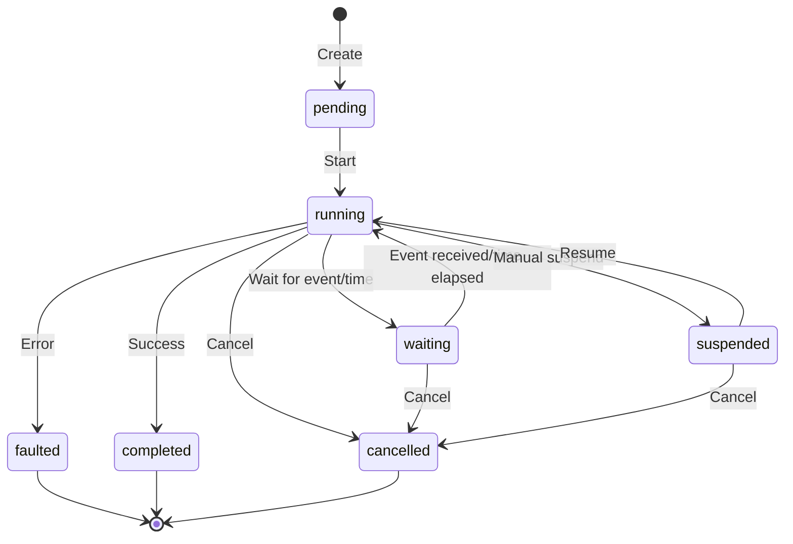

## Overview

A Serverless Workflow is a sequence of specific tasks that are executed in a defined order. By default, this order follows the declaration sequence within the workflow definition. Workflows are designed to automate processes and orchestrate various serverless functions and services.

Workflows can be triggered in different ways:
- **On request**: Manually initiated workflow execution
- **Scheduled**: Using CRON expressions for time-based triggers
- **Event-driven**: Initiated upon correlation with specific events

Additionally, workflows may optionally accept inputs and produce outputs, allowing for data processing and transformation within the workflow execution.

## Workflow Structure

A workflow definition consists of several key sections that define its behavior and components:

### Document Metadata

Every workflow begins with document metadata that identifies the workflow:

```yaml
document:
  dsl: '1.0.3'
  namespace: default
  name: my-workflow
  version: '0.1.0'
```

<ParamField path="document.dsl" type="string" required>
  The version of the Serverless Workflow DSL being used
</ParamField>

<ParamField path="document.namespace" type="string" required>
  The namespace for organizing workflows
</ParamField>

<ParamField path="document.name" type="string" required>
  A unique name for the workflow
</ParamField>

<ParamField path="document.version" type="string" required>
  The semantic version of the workflow
</ParamField>

### Use Section

The `use` section defines reusable components that can be referenced throughout the workflow:

```yaml
use:
  authentications:
    myAuth:
      basic:
        username: admin
        password: secret
  catalogs:
    global:
      endpoint:
        uri: https://github.com/serverlessworkflow/catalog
  extensions:
    - logging:
        extend: all
        before:
          - logStart:
              call: http
              with:
                method: post
                endpoint: https://logger.example.com
```

<ParamField path="use.authentications" type="object">
  Defines authentication policies that can be referenced by name
</ParamField>

<ParamField path="use.catalogs" type="object">
  Defines external resource catalogs for reusable functions
</ParamField>

<ParamField path="use.extensions" type="array">
  Defines extensions that modify task behavior
</ParamField>

<ParamField path="use.errors" type="object">
  Defines reusable error definitions
</ParamField>

<ParamField path="use.functions" type="object">
  Defines reusable function definitions
</ParamField>

<ParamField path="use.retries" type="object">
  Defines reusable retry policies
</ParamField>

<ParamField path="use.secrets" type="array">
  Lists secrets required by the workflow
</ParamField>

### Do Section

The `do` section contains the sequence of tasks to execute:

```yaml
do:
  - fetchData:
      call: http
      with:
        method: get
        endpoint:
          uri: https://api.example.com/data
  - processData:
      call: processFunction
      with:
        input: ${ .fetchData.output }
  - storeResults:
      call: http
      with:
        method: post
        endpoint:
          uri: https://api.example.com/results
        body: ${ .processData.output }
```

<Note>
  Tasks in the `do` section are executed sequentially by default, unless wrapped in a `fork` task for parallel execution.
</Note>

## Status Phases

Both workflows and tasks can exist in several phases, each indicating the current state of execution:

| Phase | Description |
|-------|-------------|
| `pending` | The workflow has been initiated and is pending execution |
| `running` | The workflow is currently in progress |
| `waiting` | The workflow execution is temporarily paused, awaiting either inbound event(s) or a specified time interval as defined by a `wait` task |
| `suspended` | The workflow execution has been manually paused by a user and will remain halted until explicitly resumed |
| `cancelled` | The workflow execution has been terminated before completion |
| `faulted` | The workflow execution has encountered an error |
| `completed` | The workflow ran to completion |

### Status Phase Transitions



<Info>
  The flow of execution within a workflow can be controlled using flow directives, which provide instructions to the workflow engine on how to manage and handle specific aspects of workflow execution.
</Info>

## Lifecycle Events

Lifecycle Cloud Events standardize notifications for key state changes in workflows and tasks. These events carry consistent information like IDs, status transitions, timestamps, and relevant metadata, enabling users to reliably respond to updates, enhancing interoperability and simplifying integration across different implementations.

Runtimes are expected to publish these events upon state changes. While using the HTTP protocol binding with structured content mode is recommended, other transports adhering to the CloudEvents specification may be used.

### Workflow Lifecycle Events

| Type | Required | Description |
|:----:|:--------:|:------------|
| `io.serverlessworkflow.workflow.started.v1` | yes | Notifies about the start of a workflow |
| `io.serverlessworkflow.workflow.suspended.v1` | yes | Notifies about suspending a workflow execution |
| `io.serverlessworkflow.workflow.resumed.v1` | yes | Notifies about resuming a workflow execution |
| `io.serverlessworkflow.workflow.correlation-started.v1` | yes | Notifies about a workflow starting to correlate events |
| `io.serverlessworkflow.workflow.correlation-completed.v1` | yes | Notifies about a workflow completing an event correlation |
| `io.serverlessworkflow.workflow.cancelled.v1` | yes | Notifies about the cancellation of a workflow execution |
| `io.serverlessworkflow.workflow.faulted.v1` | yes | Notifies about a workflow being faulted |
| `io.serverlessworkflow.workflow.completed.v1` | yes | Notifies about the completion of a workflow execution |
| `io.serverlessworkflow.workflow.status-changed.v1` | no | Notifies about the change of a workflow's status phase |

<Note>
  The `io.serverlessworkflow.workflow.status-changed.v1` event is an optional convenience event that notifies consumers solely about a workflow's status changes, without carrying extra data. It is typically used by consumers who only need to track or report status updates. Its use is optional because it requires runtimes to publish an additional event for each necessary lifecycle change.
</Note>

### Task Lifecycle Events

| Type | Required | Description |
|:----:|:--------:|:------------|
| `io.serverlessworkflow.task.created.v1` | yes | Notifies about the creation of a task |
| `io.serverlessworkflow.task.started.v1` | yes | Notifies about the start of a task |
| `io.serverlessworkflow.task.suspended.v1` | yes | Notifies about suspending a task's execution |
| `io.serverlessworkflow.task.resumed.v1` | yes | Notifies about resuming a task's execution |
| `io.serverlessworkflow.task.retried.v1` | yes | Notifies about retrying a task's execution |
| `io.serverlessworkflow.task.cancelled.v1` | yes | Notifies about the cancellation of a task's execution |
| `io.serverlessworkflow.task.faulted.v1` | yes | Notifies about a task being faulted |
| `io.serverlessworkflow.task.completed.v1` | yes | Notifies about the completion of a task's execution |
| `io.serverlessworkflow.task.status-changed.v1` | no | Notifies about the change of a task's status phase |

## Workflow Components

Serverless Workflow DSL allows for defining reusable components that can be referenced across the workflow:

### Authentications

Authentication policies define how the workflow accesses protected resources or services:

```yaml
use:
  authentications:
    apiAuth:
      basic:
        username: admin
        password: secret123
    tokenAuth:
      bearer: ${ .user.token }
    oauth2Auth:
      oauth2:
        authority: http://keycloak/realms/fake-authority/.well-known/openid-configuration
        grant: client-credentials
        client:
          id: workflow-runtime
          secret: workflow-runtime-client-secret
        scopes: [ api ]
        audiences: [ runtime ]
```

### Errors

Reusable error definitions that can be caught and handled:

```yaml
use:
  errors:
    serviceUnavailable:
      type: https://serverlessworkflow.io/spec/1.0.0/errors/communication
      status: 503
      title: Service Unavailable
```

### Functions

Reusable function definitions that can be called from tasks:

```yaml
use:
  functions:
    validateEmail:
      input:
        schema:
          document:
            type: object
            properties:
              emailAddress:
                type: string
      run:
        script:
          language: javascript
          code: |
            function validateEmail(email) {
              const re = /^[a-zA-Z0-9._-]+@[a-zA-Z0-9.-]+\.[a-zA-Z]{2,6}$/;
              return re.test(email);
            }
            return { isValid: validateEmail(emailAddress) };
```

### Retries

Reusable retry policies for handling transient failures:

```yaml
use:
  retries:
    standardRetry:
      delay:
        seconds: 3
      backoff:
        exponential: {}
      limit:
        attempt:
          count: 5
```

### Secrets

Sensitive information required by a workflow to securely access protected resources:

```yaml
use:
  secrets:
    - apiKey
    - databasePassword
    - encryptionKey
```

<Warning>
  Runtime must implement a mechanism capable of providing the workflow with the data contained within the defined secrets. If a workflow attempts to access a secret to which it does not have access rights or which does not exist, runtimes must raise an error with type `https://serverlessworkflow.io/spec/1.0.0/errors/authorization` and status `403`.
</Warning>

## Input and Output

Workflows can accept inputs and produce outputs, with optional validation and transformation:

### Workflow Input

```yaml
input:
  schema:
    document:
      type: object
      properties:
        userId:
          type: string
        operation:
          type: string
          enum: [create, update, delete]
      required:
        - userId
        - operation
  from: ${ . }
```

<ParamField path="input.schema" type="object">
  JSON Schema to validate the workflow input against before execution
</ParamField>

<ParamField path="input.from" type="string">
  Runtime expression to transform the raw workflow input. Defaults to identity expression `${ . }`
</ParamField>

### Workflow Output

```yaml
output:
  schema:
    document:
      type: object
      properties:
        result:
          type: string
        timestamp:
          type: string
          format: date-time
  as: ${ { result: .status, timestamp: now } }
```

<ParamField path="output.schema" type="object">
  JSON Schema to validate the workflow output against before completion
</ParamField>

<ParamField path="output.as" type="string">
  Runtime expression to transform the final workflow output. Defaults to identity expression
</ParamField>

## Scheduling

Workflow scheduling allows developers to specify when and how their workflows should be executed:

### CRON-based Scheduling

```yaml
schedule:
  cron: "0 0 * * *"
```

Executes the workflow at midnight every day using CRON expression.

### Interval Scheduling

```yaml
schedule:
  every:
    hours: 2
    minutes: 30
```

Executes the workflow every 2 hours and 30 minutes.

### Delayed Restart

```yaml
schedule:
  after:
    minutes: 5
```

Restarts the workflow 5 minutes after the previous execution completes.

### Event-Driven Scheduling

```yaml
schedule:
  on:
    events:
      - with:
          type: order.placed
          source: https://api.example.com/orders
```

Starts a new workflow instance when an event matching the criteria is received.

<Info>
  Event-driven scheduling defines when a new workflow instance should be created based on external events. This is different from a start `listen` task, which operates within an already instantiated workflow.
</Info>

## Complete Workflow Example

Here's a comprehensive example demonstrating various workflow features:

```yaml
document:
  dsl: '1.0.3'
  namespace: ecommerce
  name: order-processing
  version: '1.0.0'

use:
  authentications:
    apiAuth:
      bearer: ${ $secrets.apiToken }
  
  retries:
    standardRetry:
      delay:
        seconds: 2
      backoff:
        exponential: {}
      limit:
        attempt:
          count: 3
  
  secrets:
    - apiToken
    - databasePassword

input:
  schema:
    document:
      type: object
      properties:
        orderId:
          type: string
        customerId:
          type: string
      required:
        - orderId
        - customerId
  from: ${ . }

do:
  - validateOrder:
      call: http
      with:
        method: get
        endpoint:
          uri: https://api.example.com/orders/${ .orderId }
          authentication: apiAuth
  
  - processPayment:
      call: http
      with:
        method: post
        endpoint:
          uri: https://api.example.com/payments
          authentication: apiAuth
        body:
          orderId: ${ .orderId }
          amount: ${ .validateOrder.output.total }
  
  - updateInventory:
      call: http
      with:
        method: put
        endpoint:
          uri: https://api.example.com/inventory
          authentication: apiAuth
        body:
          items: ${ .validateOrder.output.items }
  
  - sendConfirmation:
      call: http
      with:
        method: post
        endpoint:
          uri: https://api.example.com/notifications
          authentication: apiAuth
        body:
          customerId: ${ .customerId }
          message: Your order has been processed successfully

output:
  as: ${ { orderId: .orderId, status: "completed", timestamp: now } }
```

## Best Practices

<Steps>
  <Step title="Use meaningful names">
    Give your workflow and tasks descriptive names that clearly indicate their purpose.
  </Step>
  
  <Step title="Define input/output schemas">
    Always validate workflow and task inputs/outputs using JSON Schema to catch errors early.
  </Step>
  
  <Step title="Centralize authentication">
    Define authentication policies in the `use` section and reference them by name for better maintainability.
  </Step>
  
  <Step title="Use reusable components">
    Define functions, retries, and errors in the `use` section when they're needed multiple times.
  </Step>
  
  <Step title="Handle errors gracefully">
    Use try-catch blocks and retry policies to handle transient failures and make workflows resilient.
  </Step>
</Steps>

## Common Patterns

### Sequential Processing

```yaml
do:
  - step1:
      call: function1
  - step2:
      call: function2
  - step3:
      call: function3
```

Tasks execute one after another in declaration order.

### Conditional Execution

```yaml
do:
  - checkCondition:
      switch:
        - when: ${ .priority == "high" }
          then: processHighPriority
        - when: ${ .priority == "medium" }
          then: processMediumPriority
        - when: ${ .priority == "low" }
          then: processLowPriority
```

Execute different tasks based on runtime conditions.

### Parallel Processing

```yaml
do:
  - parallelTasks:
      fork:
        branches:
          - task1:
              call: function1
          - task2:
              call: function2
          - task3:
              call: function3
```

Execute multiple tasks simultaneously for improved performance.

## Related Topics

- [Tasks](/core/tasks) - Learn about different task types and their properties
- [Task Flow](/core/task-flow) - Understand how tasks are executed and controlled
- [Data Flow](/core/data-flow) - Learn how data flows through workflows
- [Scheduling](/core/scheduling) - Deep dive into workflow scheduling options
- [Events](/core/events) - Work with event-driven workflows
